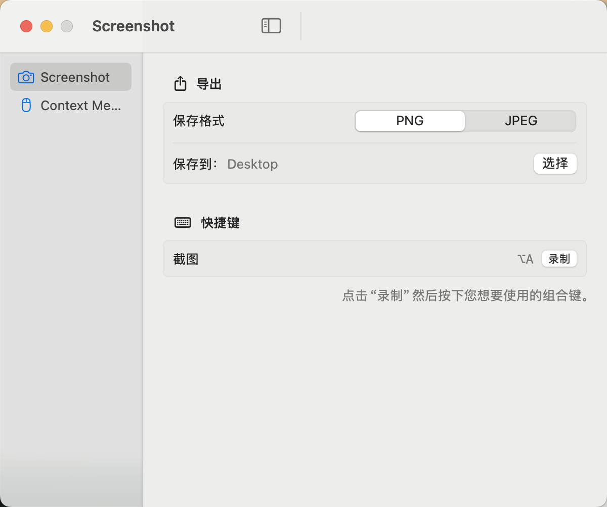
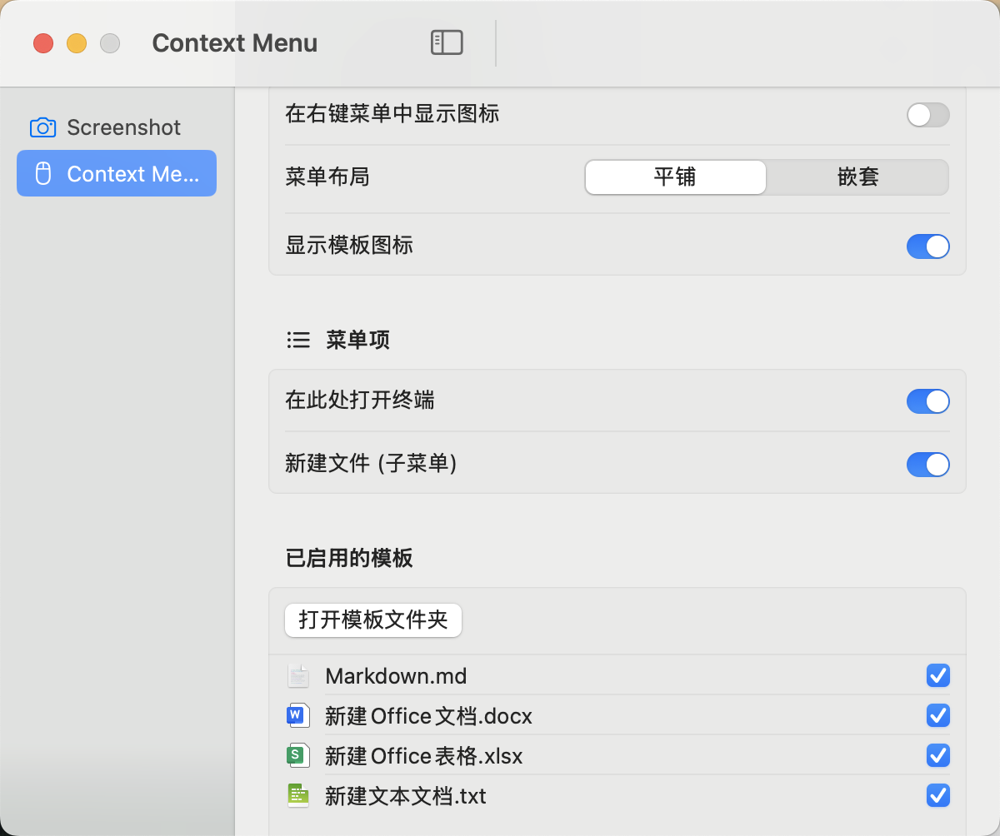

# TermSnap 📸 💻

**TermSnap** 是一款专为 macOS 设计的轻量级生产力工具，集成了 **智能截图标注** 以及 **Finder 快捷打开终端** 核心功能。它常驻于菜单栏，旨在为开发者和设计师提供最丝滑的工作流。

---

## 🚀 核心功能

### 1. 智能截图与标注
- **窗口智能识别**：自动捕捉鼠标下的窗口边缘，支持高亮选区。
- **全屏快捷选中**：鼠标移动到空白桌面即可一键选中全屏。
- **全新 Pro 标注工具栏**：
    *   **极简设计**：重新设计的紧凑型工具栏，减少屏幕占用，宽度从 720px 深度优化至 400px。
    *   **精准颜色选择**：配备 14x14 精致方块颜色指示器，点击后颜色面板在鼠标附近动态弹出，支持系统级全色域选择。
    *   **无感文字录入**：更清爽的文字输入体验，去除冗余边框，支持实时字号调节。
- **丰富工具**：支持矩形、圆形、箭头、直线、自由画笔及马赛克（像素化）。

### 2. Finder 扩展 (Open Terminal Here)
- 在 Finder 目录或文件上右键，直接在当前目录打开终端。
- 极速响应，无需手动 `cd`，大幅提升目录切换效率。

---

## 🛠 编译与打包

本项目使用 Swift 5 编写，要求 macOS 14.6 或更高版本。

### 自动化构建 (推荐)
```bash
chmod +x build.sh
./build.sh
```
打包后的 App 将位于 `./build/Release/TermSnap.app`。

### Xcode 构建
1. 打开 `TermSnap.xcodeproj`。
2. 选择 `TermSnap` Scheme 并进行 **Archive**。

---

## 📦 安装与配置 (重要)

由于 macOS 的安全机制，Finder 扩展需要手动激活：

1. **移动应用**：将 `TermSnap.app` 拖入 **`/Applications` (应用程序)** 文件夹。
2. **首次运行**：双击打开一次 TermSnap。
3. **启用扩展**：
   - 打开 **系统设置 > 隐私与安全性 > 扩展 > Finder 扩展**。
   - 勾选 **TermSnap** 选项。
4. **重启 Finder**：运行 `killall Finder` 刷新右键菜单。

---

## ⌨️ 快捷键

- **截图模式**：
  - `Enter`: 完成并复制到剪贴板。
  - `Esc`: 取消截图。

---

## 📄 开源协议

本项目采用 MIT 协议。

---

> [!TIP]
> 觉得好用？给个 Star ⭐️ 支持一下吧！
